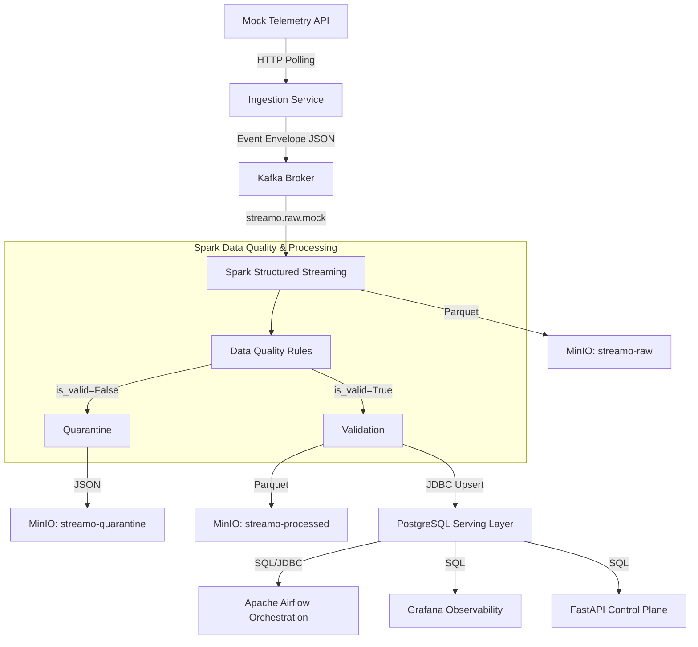

# Streamo Architecture

## High-Level Pipeline

Streamo is designed as a highly scalable, real-time data engineering platform capable of processing event streams with resilience, exactly-once guarantees, and high observability.

## Component Roles

### 1. Mock API (`services/mock_api`)
Simulates an upstream data provider, emitting temperature and humidity telemetry. 

### 2. Ingestion Service (`services/ingestion`)
A robust Python service utilizing `httpx` and `tenacity` to poll upstream APIs and publish standard Event Envelopes to Kafka.

### 3. Kafka (`confluentinc/cp-kafka`)
The central nervous system of Streamo. It acts as an asynchronous buffer, decoupling ingestion from processing. 

### 4. Spark Structured Streaming (`services/processing`)
The compute engine. It reads continuously from Kafka, parses JSON, and applies strict Data Quality rules.
- **Raw Persistence**: Writes unmodified JSON payloads directly to `streamo-raw`.
- **Data Quality**: Validates types, required fields, formats (UUID), and ranges. Computes aggregate DQ metrics.
- **Processed Records**: Normalizes schema, flattens JSON, adds watermarks, and deduplicates based on `event_id`.
- **Aggregates**: Computes 5-minute tumbling window metrics.
- **Quarantine**: Reroutes malformed and invalid records to `streamo-quarantine`.

### 5. MinIO Object Storage
The Data Lake layer. 
- `streamo-raw`: Historical, immutable landing zone. Partitioned by `year/month/day/hour`.
- `streamo-processed`: Clean, tabular Parquet files ready for deep analytics.
- `streamo-quarantine`: Dump for invalid schemas.

### 6. PostgreSQL Serving Layer
The Analytics Serving layer for the Control Plane. Spark UPSERTs processed records, metrics, and aggregates directly into SQL tables to provide sub-second query performance for FastAPI downstream consumers.

### 7. Apache Airflow
The orchestration engine. Airflow does not process data directly. Instead, it schedules DAGs to:
- Monitor Data Quality and raise alerts if thresholds are breached (`streamo_data_quality`).
- Aggregate real-time metrics into daily rollups (`streamo_daily_aggregation`).
- Execute background data retention policies (`streamo_maintenance`).

### 8. Grafana
The observability platform. Grafana queries PostgreSQL via SQL to visualize:
- Data Quality rates, valid vs invalid partitions, and quarantine volume.
- End-to-end pipeline latency and ingestion freshness.
- Live telemetry trends (Temperature & Humidity).
